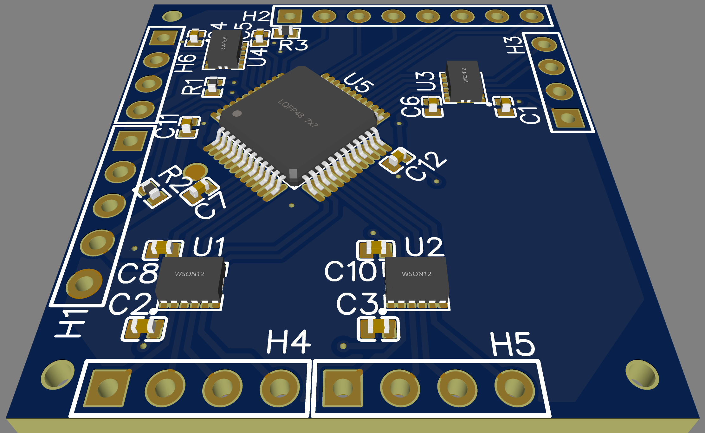

# Gego Motor shield hardware
Motor shield hardware for controlling 8 DC motors

With [STM32F030C8T6](https://www.st.com/en/microcontrollers-microprocessors/stm32f030c8.html) as main controller and four [DRV8835DSSR](https://www.ti.com/store/ti/en/p/product/?p=DRV8835DSSR) 11 V, 1.5 A dual H-bridge motor drivers for controlling 8 brushed DC motors or 4 stepper motors
It could serve as daughter module in complex system connected to controling CPU using I2C or serial (UART) protocol. Or can serve as controling CPU as STM32 has 9 unused pins connected to pin headers.

I will try to use it to control [LEGO Technic](https://en.wikipedia.org/wiki/Lego_Technic) motors in both roles:
- as main controller with [PS2 wireless controller](https://www.aliexpress.com/w/wholesale-ps2%20wireless%20controller.html)
- as daughter module with micro:bit as main controller

# License
Motor shield hardware for controlling 8 DC motors by devegied is licensed under [CC BY 4.0](https://creativecommons.org/licenses/by/4.0).
